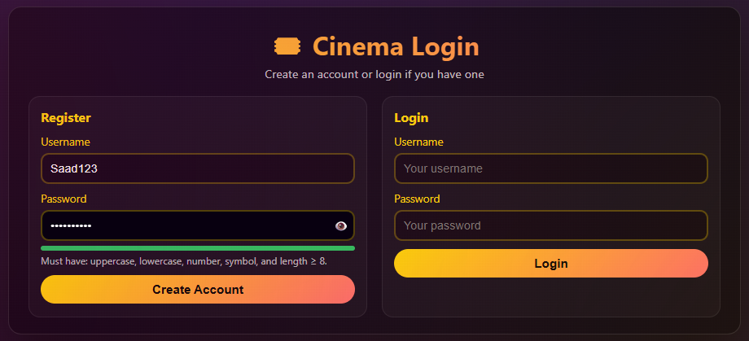
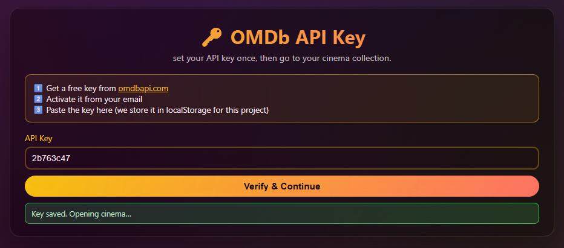
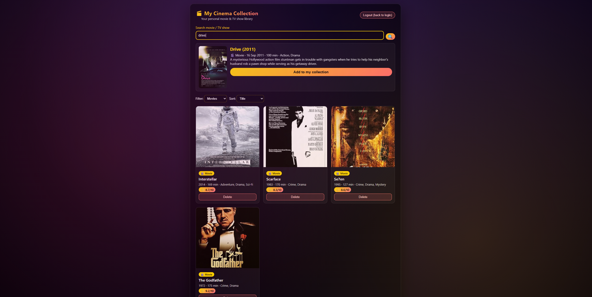

# Cinema Collection (OMDb)

Live Demo: [https://cinema-collection.netlify.app/](https://iis3d16.github.io/Cinema-Collection/)

## Overview
A cinema library web app that uses the OMDb API to search movies/TV shows and manage a personal collection.

## Pages
- Register / Login (demo)
- OMDb API validation
- Library (add/remove items)

## Tech
- HTML, CSS, JavaScript
- OMDb API
- Netlify hosting

## Security Notes
This is a frontend-only demo project (no backend). Authentication is client-side for demonstration purposes.

## Screenshots

### Login / Register

### OMDb API Validation

### Library

